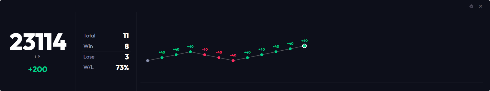

# SF6 Scouter

**SF6 Scouter** is a lightweight, real-time statistics tracker for Street Fighter 6. Designed for players and streamers, it provides live updates on your performance, including wins, losses, and rank point changes.

> **Hover to track, win while you're hot, quit while you're cold.**

[English] | [简体中文](./README_zh.md) | [日本語](./README_ja.md)

## 🚀 Key Features

- **Real-Time Tracking**: Automatically records wins, losses, and win rate for the current session.
- **Rank Points (LP/MR)**: Supports both LP and MR. Clearly shows point gains/losses since starting the app.
- **Multi-Account Tracking**: Track not only yourself but also other players by entering their **CFN ID**.
- **Pro Data Panel**: A brand-new professional dashboard that visualizes historical battle records and score trends with **line charts**.
- **Personalized Memory**: Automatically remembers your panel configuration (position, size, transparency) and restores it on the next launch.
- **UI Effects**: Dynamic value scrolling and UI interaction effects for a more vibrant data display.
- **Streamer Friendly**:
  - **Transparency Mode**: Easily overlay stats onto your stream using filters in OBS or similar software.
  - **Always on Top**: Keep tracking your performance even when playing in windowed or borderless mode.
- **Auto Update**: Built-in update module ensures you get the latest features immediately.

## 📸 Preview

| Score Tracking (LP) | Score Tracking (MR) | Pro Data Panel |
| :---: | :---: | :---: |
|  |  |  |
| **Real-time Updates** | | |
|  | | |

## 🛠️ How to Use

1. **Launch & Login**: Open `SF6 Scouter`, click "Login to CFN", and log in through the popup window.
2. **Account Selection**: After login, it defaults to tracking your account. You can also enter any **CFN ID** to track other players.
3. **Switch Panels**: Toggle between "**Mini Mode**" and "**Pro Mode**" with a single click. The Pro panel supports zooming into charts, filtering records, and other custom settings.
4. **Customize Appearance**: Resize by dragging edges or adjust transparency in settings. The Pro panel's layout and display options can also be fine-tuned to your preference. All changes are saved automatically.
5. **Real-time Monitoring**: The app polls for data every 15 seconds. Start your journey!

## 🤝 Community & Support

Join us for bug reports, feature requests, or just to chat!

- **Discord**: [Join our Discord](https://discord.gg/xg93c5mmx2)
- **QQ Group**: Scan the code below to join (China)

| Discord | QQ Group |
| :---: | :---: |
|  |  |

## 🛡️ Software Safety

To ensure your security, every release of **SF6 Scouter** is verified through [VirusTotal](https://www.virustotal.com/). We prioritize software safety and transparency for all our users.

## ⚖️ License & Terms

This project is licensed under the **GPL-3.0 License**.

### 🚫 Non-Commercial Use Only
- **Strictly No Profit**: This tool is for personal use and streaming only. It is **strictly prohibited** to sell, bundle, or redistribute this software (or any derivative works) for profit.
- **Open Source Requirement**: If you modify and redistribute this software, you **must** release your source code under the same GPL-3.0 license and attribute the original author (RengarLee).
- **No Warranty**: This project is not affiliated with Capcom. Use at your own risk.
