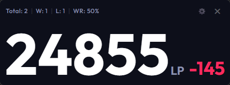
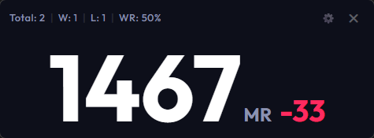
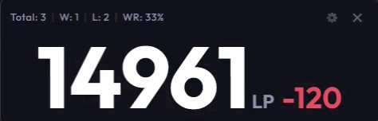
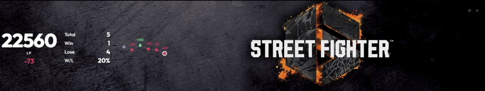
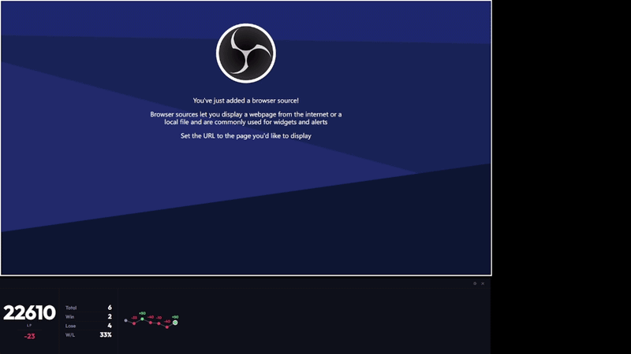
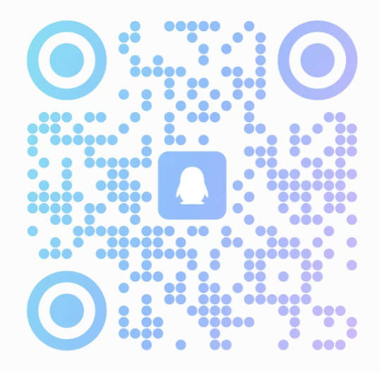

# SF6 Scouter

**SF6 Scouter** は、ストリートファイター6 向けの軽量なリアルタイム戦績トラッカーです。プレイヤーや配信者向けに設計されており、勝敗数やランクポイントの変動をライブで表示します。

> **オーバーレイで戦績確認、勝てる時に稼ぎ、冷めたら即ヤメ。**

[English](./README.md) | [简体中文](./README_zh.md) | [日本語]

## 🚀 主な機能

- **リアルタイムトラッキング**: セッション中の勝敗数、勝率を自動で記録します。
- **ランクポイント (LP/MR)**: LP（リーグポイント）と MR（マスターレート）の両方に対応。アプリ起動时からの増減値を明确に表示します。
- **マルチアカウント対応**: ログイン後、自分のアカウントだけでなく、**CFN ID** を入力することで他のプレイヤーの戦績も追跡可能です。
- **Pro データパネル**: 新設計のプロフェッショナルダッシュボード。対戦履歴やスコアの推移を**折線グラフ**で直感的に視覚化します。
- **パーソナライズメモリ**: ウィンドウの位置、サイズ、透明度などの設定を自動的に保存し、次回起動時に完全に復元します。
- **UI エフェクト**: 数値の動的スクロールや UI インタラクションエフェクトを追加し、データ表示をよりダイナミックに。
- **配信者向け機能**:
  - **透過モード**: OBS などの配信ソフトでフィルターを使用して、簡単にオーバーレイとして利用可能です。
  - **最前面表示**: ウィンドウモードやボーダレスモードでのプレイ中も、常に戦績を確認できます。
- **自動アップデート**: アップデート機能内蔵により、常に最新の機能をいち早く利用できます。

## 📸 プレビュー

### Mini モード (Mini View)

| ランクポイント (LP) | マスターレート (MR) | リアルタイム更新デモ |
| :---: | :---: | :---: |
|  |  |  |

### Pro モード (Pro View)

| Pro パネル | OBS との連携 (Pro with OBS) |
| :---: | :---: |
|  *(透過モード、背景画像は公式サイトより)* |  |

## 🛠️ 使い方

1. **起動とログイン**: `SF6 Scouter` を開き、「Login to CFN」をクリックしてポップアップウィンドウからログインします。
2. **アカウント選択**: ログイン後はデフォルトで自分のアカウントを追跡します。設定や検索バーに他のプレイヤーの **CFN ID** を入力して追跡することも可能です。
3. **パネルの切り替え**: ボタン一つで「**Mini モード**」と「**Pro モード**」を切り替えられます。Pro パネルではグラフのズームや履歴のフィルタリングなど、詳細なカスタマイズが可能です。
4. **外観のカスタマイズ**: ウィンドウの端をドラッグしてサイズを調整したり、設定で透明度を変更したりできます。Pro パネルのレイアウトや表示内容も細かく調整可能です。すべての変更は自動的に保存されます。
5. **リアルタイム監視**: アプリは 15 秒ごとにデータを自動取得します。ストリートファイター6の旅を楽しみましょう！

## 📺 OBS 設定チュートリアル

配信で **SF6 Scouter** を使用する場合は、以下の手順に従ってください。

1. **ソースの追加**:
   - OBS の「ソース」パネルで `+` をクリックします。
   - **ウィンドウキャプチャ** を選択します。
   - 「ウィンドウ」で `SF6 Scouter` を选择します。
   - 「キャプチャ方式」を **Windows 10 (1903 以降)** に設定します。
2. **アプリの設定**:
   - アプリの ⚙️ アイコンをクリックして設定を开きます。
   - **最前面表示 (Always on Top)** を **オフ (Off)** に切り替えます。

## 🤝 コミュニティ & サポート

バグ報告や機能のリクエスト、交流などは以下のコミュニティへどうぞ！

- **Discord**: [Discord に参加](https://discord.gg/xg93c5mmx2)
- **QQ グループ**: QRコードをスキャンして参加（中国国内向け）

| Discord | QQ グループ |
| :---: | :---: |
|  |  |

## 🛡️ ソフトウェアの安全性

ユーザーの皆様に安心してご利用いただくため、**SF6 Scouter** のすべてのリリースは [VirusTotal](https://www.virustotal.com/) で検証されています。私たちは、ソフトウェアの安全性と透明性を最優先事項としています。

## ⚖️ ライセンスと利用規約

本プロジェクトは **GPL-3.0 ライセンス** の下で公開されています。

### 🚫 商用利用の禁止
- **営利目的の禁止**: 本ツールは個人の学習およびゲーム配信での利用を目的としています。本ツール（およびその改変版）を販売、有料配布、広告の埋め込みなどの**営利目的で利用することは固く禁じられています**。
- **オープンの義務**: 本プロジェクトを改変して配布する場合、**必ず** GPL-3.0 ライセンスの下でソースコードを公開し、原作者（RengarLee）の情報を保持する必要があります。
- **免责声明**: 本プロジェクトはカプコン公式とは一切関係ありません。利用によるいかなるリスクも利用者が负うものとします。
