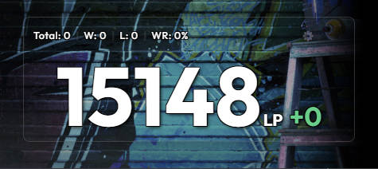

# SF6 Scouter

**SF6 Scouter** 是一款轻量级的《街头霸王6》实时战绩追踪工具。专为玩家和主播设计，实时同步胜率、排位分增减等核心数据。

> **悬浮看分，手热吃分，手冷下机。**

[English](./README.md) | [简体中文] | [日本語](./README_ja.md)

## 🚀 核心功能

- **实时追踪**：自动记录当前 Session 的胜、负场次及胜率。
- **排位分追踪 (LP/MR)**：同时支持 LP（段位分）和 MR（大师分）。清晰显示自启动程序以来的分数增减情况。
- **主播友好**：
  - **绿幕模式**：开启后可方便地通过 OBS 等软件滤镜叠加到直播画面中。
  - **窗口置顶**：即使在窗口/无边框模式下游戏，也能随时查看实时战绩。
- **简单配置**：只需通过官方 Buckler's Booty 网站登录一次，应用即可自动抓取您的 CFN ID 并开始追踪。

## 📸 预览

| 积分追踪 (LP) | 积分追踪 (MR) |
| :---: | :---: |
|  |  |
| **实时更新演示** | **透明模式** |
|  |  |

## 🛠️ 使用方法

1. **启动**：打开 `SF6 Scouter`。
2. **登录**：点击 "Login to CFN" 按钮，在弹出的窗口中登录官方网站。
3. **识别**：登录成功后，应用会自动识别您的用户 ID 并切换至仪表盘界面。
4. **游戏**：开始您的街霸之旅！应用每 15 秒会自动轮询数据。
5. **设置**：点击 ⚙️ 图标可以：
   - 切换 LP / MR 显示。
   - 开启/关闭绿幕模式。
   - 重置当前 Session 的统计数据。

## 🤝 社区与支持

欢迎提交 Bug、提供功能建议或加入讨论！

- **Discord**: [加入 Discord](https://discord.gg/xg93c5mmx2)
- **QQ 群**: 扫码加入（中国）

| Discord | QQ 群 |
| :---: | :---: |
|  |  |

## 🛡️ 软件安全

为了确保您的安全，**SF6 Scouter** 的每一个发布版本都会通过 [VirusTotal](https://www.virustotal.com/) 进行验证。我们致力于为所有用户提供安全透明的软件体验。

## ⚖️ 授权协议与使用条款

本项目采用 **GPL-3.0 授权协议**。

### 🚫 严禁商用
- **禁止盈利**：本工具仅供个人学习及游戏直播使用。**严禁**任何个人或机构将本工具（及其修改版）用于商业盈利，包括但不限于：付费出售、捆绑代售、内置广告等。
- **开源义务**：如果您修改并发布本项目，**必须**同样以 GPL-3.0 协议公开源代码，并保留原作者信息（RengarLee）。
- **免责声明**：本项目与 Capcom 官方无关，因违规使用导致的任何风险由使用者自行承担。

