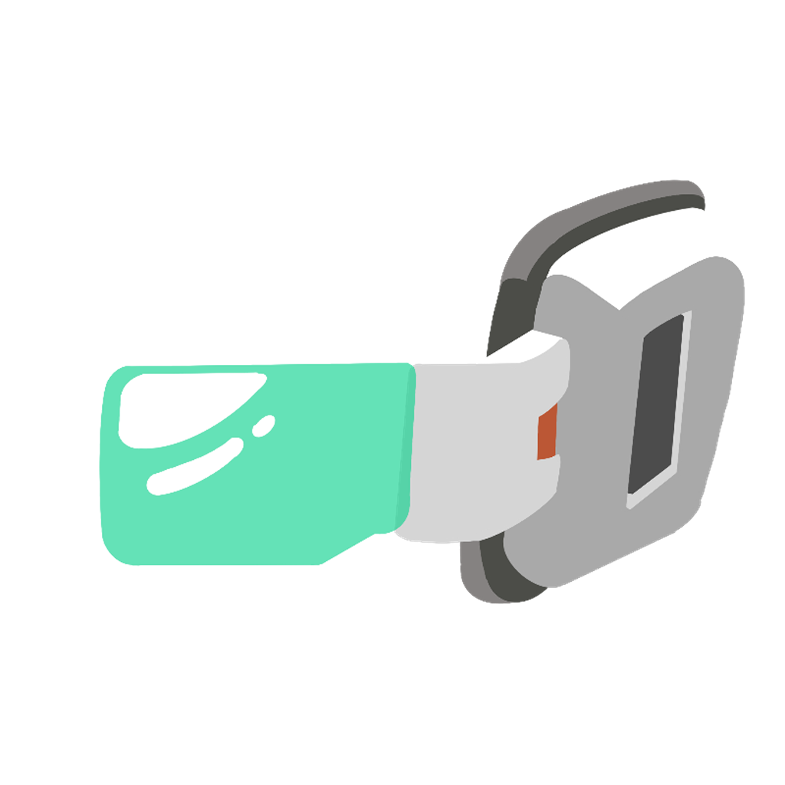
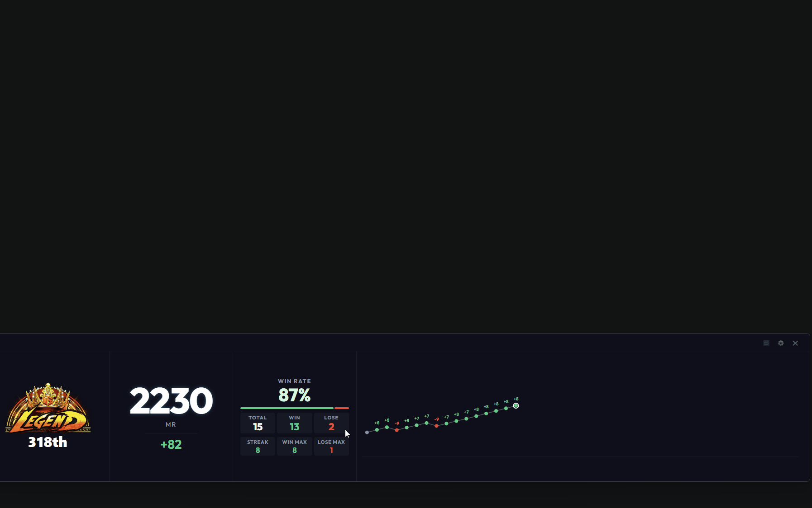
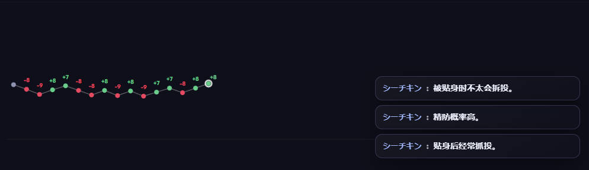
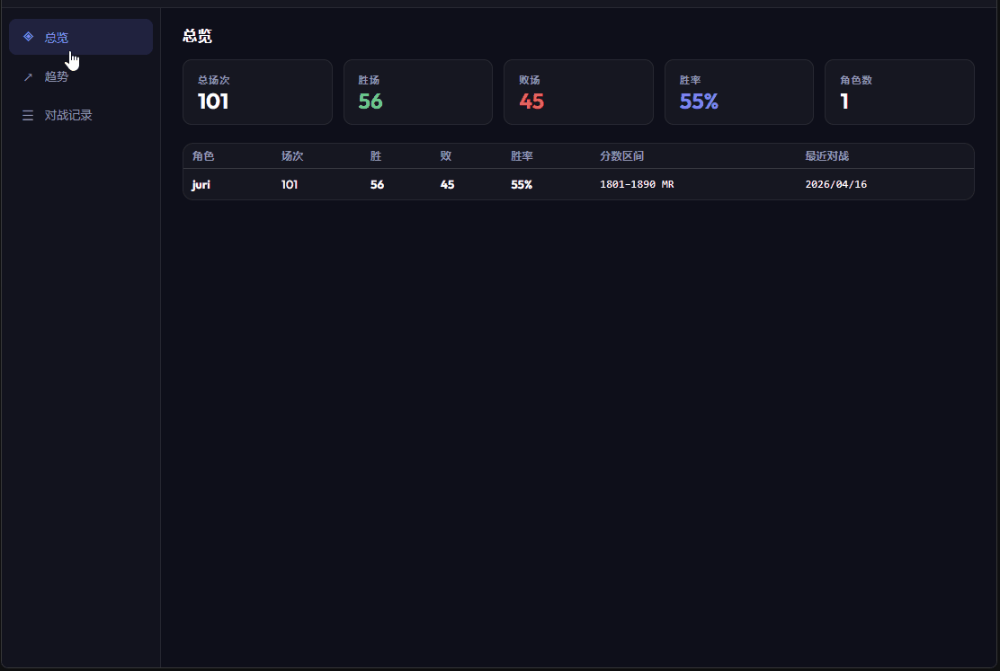
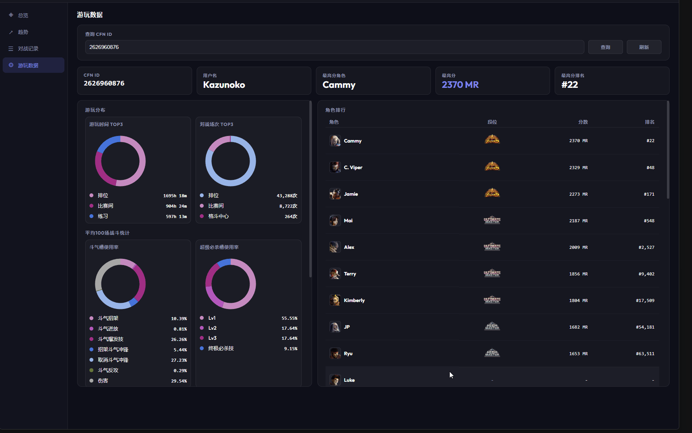
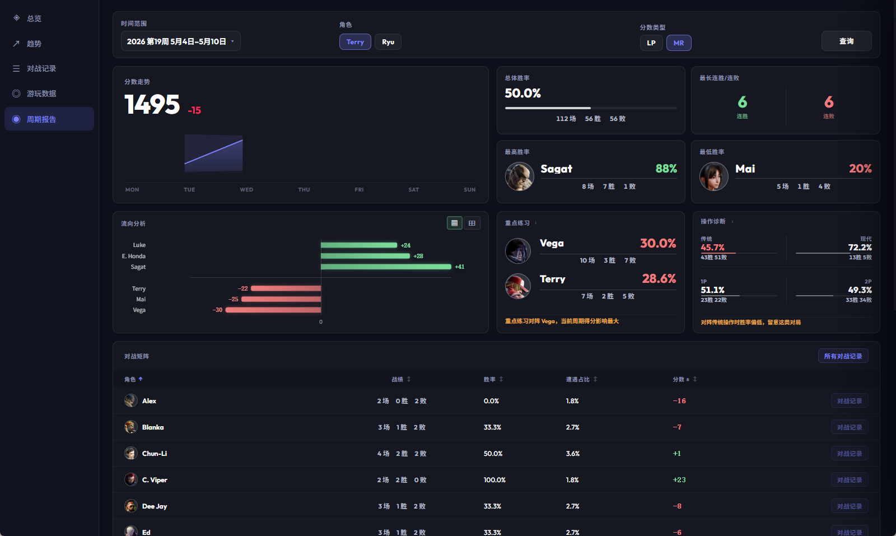

#  SF6 Scouter

**SF6 Scouter** 是一个面向《街头霸王6》玩家和主播的可运行应用，重点提供 **实时战绩追踪**、**分数变化展示**、**Pro 悬浮面板** 和 **数据分析**。

> **悬浮看分，手热吃分，手冷下机。**

[English](./README.md) | [简体中文] | [日本語](./README_ja.md)

## 仓库说明

本仓库是 **SF6 Scouter 可运行应用的分发仓库**，用于提供网站、预览图、发布说明和下载入口。

- 这里提供的是可直接使用的应用及相关公开资源。
- 这里 **不包含应用源码**。

## 核心功能

- **实时对战追踪**：记录当前会话中的胜负、胜率和分数变化。
- **LP / MR 双支持**：同时支持段位分和大师分，清晰展示增减幅度。
- **CFN 账号追踪**：登录一次后即可追踪自己的账号，也可以切换查看其他 CFN ID。
- **Mini 悬浮面板**：提供紧凑视图，适合边打边看。
- **Pro 专业面板**：提供更完整的面板布局、图表展示和更强的信息密度。
- **数据分析页面**：查看分数走势、对战数据、角色数据等更深入的信息。
- **对手习惯提示**：在应用内直接提示对手倾向，辅助判断。
- **OBS 透明支持**：方便叠加到直播画面中。
- **布局记忆**：自动记住窗口位置、大小、透明度和相关显示设置。
- **内置自动更新**：新版本可以直接在应用内获取。

## 功能预览

### 迷你模式

| LP 追踪 | MR 追踪 | 实时变化 | 透明模式 |
| :---: | :---: | :---: | :---: |
|  |  |  |  |

| 紧凑实时追踪 |
| :---: |
|  |

### 专业面板

| 透明专业悬浮面板 | 适配 OBS 的直播布局 |
| :---: | :---: |
|  |  |

| 在 Pro 面板中查看数据分析 | 提示对手习惯 |
| :---: | :---: |
|  |  |

### 数据分析页面

| 分数走势拆解 | 对战与角色洞察 | 周期报告复盘 |
| :---: | :---: | :---: |
|  |  |  |

## 使用方法

1. 下载并启动 `SF6 Scouter`。
2. 在弹出窗口中登录 **CFN**。
3. 默认追踪自己的账号，也可以输入其他 **CFN ID** 查看其他玩家。
4. 按需要在 **Mini** 和 **Pro** 之间切换。
5. 需要更深入的数据时，打开 **数据分析页面** 查看走势和明细。
6. 根据需求调整透明度、布局和显示方式，应用会自动记住你的设置。

## OBS 配置

1. 在 OBS 中添加 **窗口采集**。
2. 选择 `SF6 Scouter` 窗口。
3. 采集方式使用 **Windows 10 (1903 及以上)**。
4. 在应用内按需调整透明度和相关显示选项。

## 社区

- **Discord**: [加入 Discord](https://discord.gg/xg93c5mmx2)
- **QQ 群**: 扫描 `./images/qq.jpg` 中的二维码加入

| Discord | QQ 群 |
| :---: | :---: |
|  |  |

## 安全性

发布版本会在分发前通过 [VirusTotal](https://www.virustotal.com/) 检查。

## 许可

本仓库采用 **GPL-3.0** 许可。

- **免责声明**：本项目与 Capcom 官方无关，使用风险由使用者自行承担。
- **分发说明**：本仓库分发的是可运行应用及相关资源，不是应用源码仓库。
